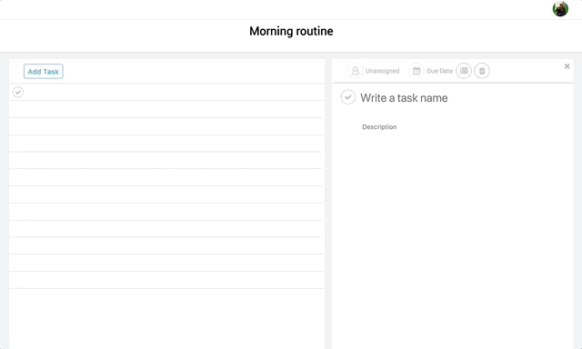
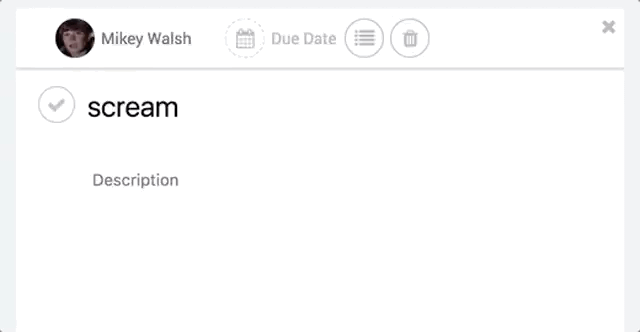
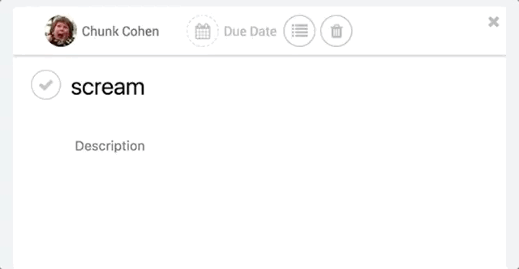

# Duabl

[Duabl live](http://duabl.herokuapp.com)

Duabl is a full-stack web application inspired by Asana. It uses a Ruby on Rails backend, a PostgreSQL database, and React.js with Redux on the frontend.

## Features & Implementation

### Single page

Duabl is a single page app that allows for seamless navigation between projects and tasks. Data is fetched through a JSON api, with components updated when necessary to provide an uninterrupted user experience.

### Simultaneously Updating Components

Duabl displays both project-level and task-level views of the user's tasks inside sibling components. When a task is edited in one component, changes will be reflected in its counterpart and vice versa.

### Autosearch Users

Duabl allows users to assign tasks to fellow team members using an autosearching input field. This makes assigning tasks quick and easy for the user.

### Custom Date Picker

Duabl features a custom date picker component built using vanilla javascript and CSS.

## Future Features

### Filters

Asana has the ability to filter tasks by due date, creation, asignee, completeness and teams. This adds a convenient layer for user to see the progress of their teams' tasks.

### WebSockets

Duabl currently saves tasks and projects based on a short timeout, but to have a truly seamless UX, I'd like to implement a connection to the backend using WebSockets so that all changes the user makes are reflected on the backend.

### Calendar

A calendar view of projects and tasks will be helpful to visualize which tasks need to be completed and when.
